## {}

::: columns
::: {.column width="37.5%"}
:::
::: {.column width="60%"}

::: {.title data-id="title"}
Semantic vectors for forecasting: mixtime
:::

::: {.dateplace}
10th June 2026
:::

Mitchell O'Hara-Wild, Monash University

::: {.smaller}
Supervised by Rob Hyndman and George Athanasopolous
:::

::: {.callout-link}

## Useful links

{.icon} [social.mitchelloharawild.com](https://social.mitchelloharawild.com/)

{.icon} [slides.mitchelloharawild.com/mixtime-supsi](https://slides.mitchelloharawild.com/mixtime-supsi)

{.icon} [mitchelloharawild/mixtime-supsi](https://github.com/mitchelloharawild/mixtime-supsi)

:::

:::
:::

{.image-left}


## {}

```{r}
library(mixtime)
```

::: {.r-stack}
{.image-full}

{.image-full .fragment}

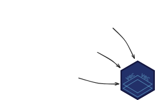{.image-full .fragment}
:::


## {}

::: {.r-stack}
{.image-full}

{.image-full .fragment}

{.image-full .fragment}
:::


## {}

::: {.r-stack}
{.image-full .fragment .fade-out fragment-index=9}

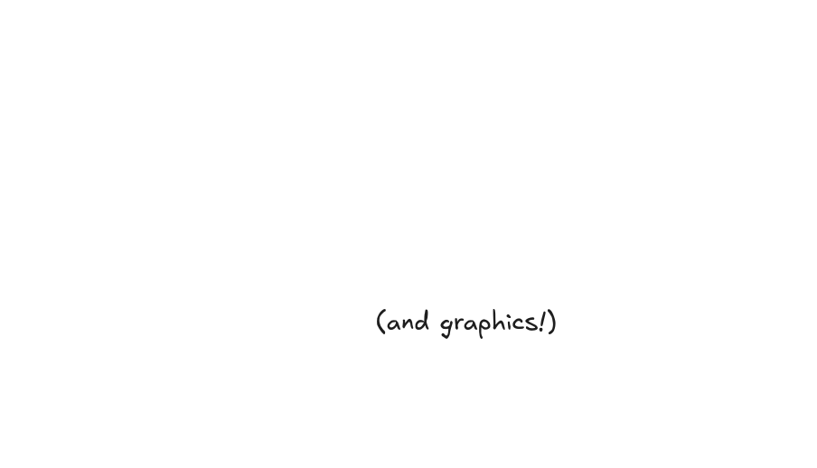{.image-full .fragment fragment-index=8}

[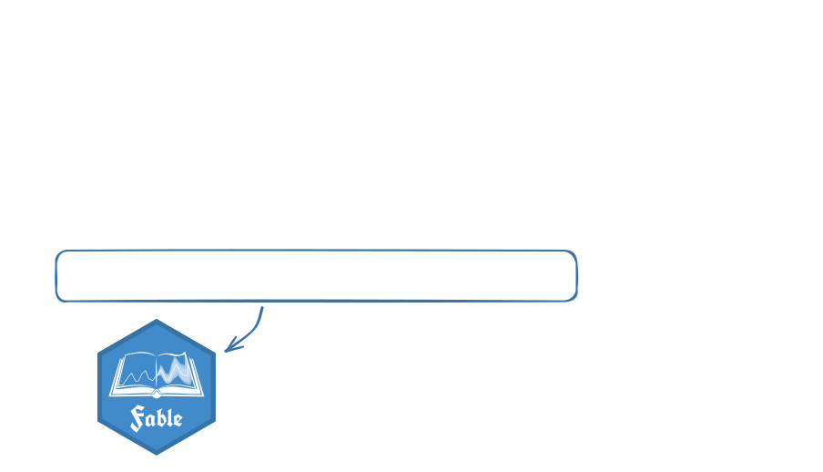{.image-full .fragment fragment-index=2}]{.fragment .fade-out fragment-index=9}

[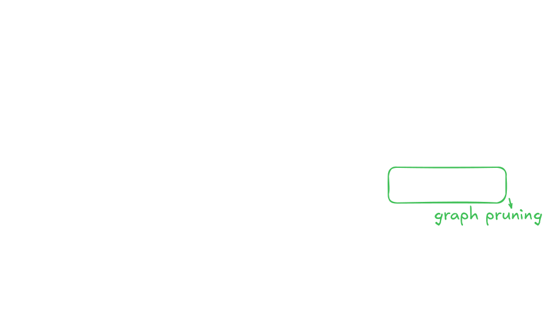{.image-full .fragment fragment-index=3}]{.fragment .fade-out fragment-index=9}

[{.image-full .fragment fragment-index=4}]{.fragment .fade-out fragment-index=9}

<!-- [{.image-full .fragment fragment-index=5}]{.fragment .fade-out fragment-index=9} -->

[{.image-full .fragment fragment-index=6}]{.fragment .fade-out fragment-index=9}

{.image-full .fragment fragment-index=7}

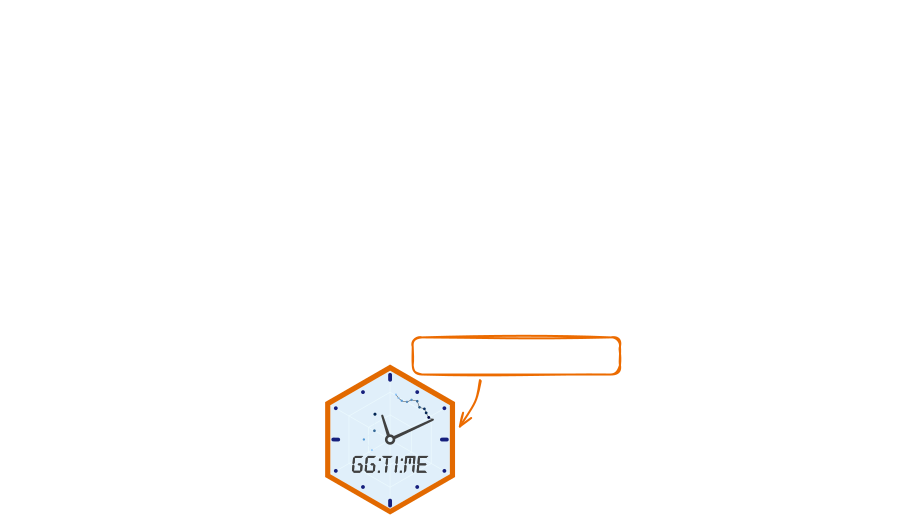{.image-full .fragment fragment-index=8}

{.image-full .fragment fragment-index=9}
:::


## {.center}

### Not just reconciliation

Better time systems support...

[🛠️ safer statistical manipulation 🛠️]{.fragment}  

[📈 time-series visualisation 📈]{.fragment}  

[⏳ improved modelling of time ⏳  
(e.g. holidays, seasonality in other calendars)]{.fragment}

## {}

::: columns
::: {.column width="60%"}

### Time is tricky!

Time seems simple - continuous and ordinal.

In practice, time is complex - resulting in many different data structures to represent:

[⏱️ Temporal granularities]{.fragment}  
[🗺️ Time zones (and daylight savings time)]{.fragment}  
[📅 Calendar systems (and time systems)]{.fragment}  
[💽 Encodings (sequence, offset, component)]{.fragment}  
[🕰️ Time model (continuous and discrete)]{.fragment}  
[🔁 Time type (linear, cyclical, duration, ...)]{.fragment}  
[✍️ Time formatting (parse and deparse)]{.fragment}  
[😵‍💫 and all combinations of the above!]{.fragment}  

:::
:::

{.image-right}

## {.center}

::: {style="font-size: 2.5em;"}

How do we represent time?  

:::


::: {style="font-size: 1.5em;"}

(& what isn't represented?)

:::


## {.center}

::: {style="font-size: 2.5em;"}

How do we represent time?  

:::


::: {style="font-size: 1.5em;"}

**Physically?**

:::


## {}

<!-- ### Representing time -->

::: {.r-stack}


{.fragment}
:::

## {.center}

::: {style="font-size: 2.5em;"}

How do we represent time?  

:::


::: {style="font-size: 1.5em;"}

*Artistically?*

:::

## {}

<!-- ### Representing time -->

::: {.r-stack}


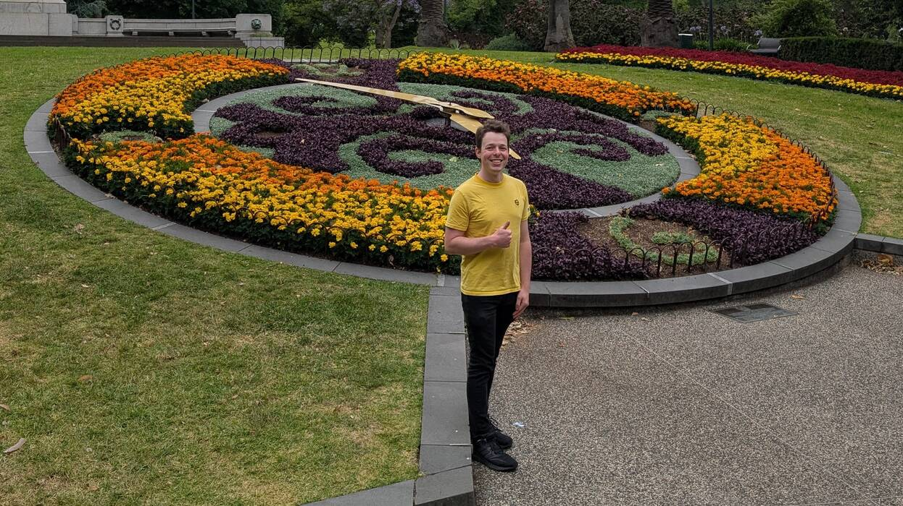{.fragment}
:::


## {.center}

::: {style="font-size: 2.5em;"}

How do we represent time?  

:::


::: {style="font-size: 1.5em;"}

`Computationally?`

:::

## {.center}

::: {style="font-size: 5em;"}

🤪

:::


## {}

::: columns
::: {.column width="60%"}

### Time is tricky!

Time seems simple - continuous and ordinal.

In practice, time is complex - resulting in many different data structures to represent:

⏱️ Temporal granularities  
🗺️ Time zones (and daylight savings time)  
📅 **Calendar systems** (and time systems)  
💽 **Encodings** (sequence, offset, component)  
🕰️ **Time model** (continuous and discrete)  
🔁 **Time type** (linear, cyclical, duration, ...)  
✍️ Time formatting (parse and deparse)  
😵‍💫 and all combinations of the above!  

:::
:::

{.image-right}

## {.fragment-remove}

::: columns
::: {.column width="60%"}

### Calendar systems and algorithms

::: {.fragment .fade-out fragment-index=1}
> One of the most fascinating books I've read all year. Takes chronology into the computer age with impressive erudition and elan.
> 
> [...]
> 
> A must for everyone who worries about days, months, years – and why they never quite fit.
> 
> *Ian Stewart*
:::

::: {.fragment .fade-up fragment-index=2}

> The goal of calcal is to do calendrical calculations, based on the algorithms described in Reingold and Dershowitz (2018) *Calendrical Calculations: The Ultimate Edition*.
>
> *Rob Hyndman*

{.sticker-float-right style="top: 5em;"}

:::

::: {.fragment .fade-up fragment-index=3 style = "padding-top: 2em;"}

> "But can we do better?"
>
> *Me* 🤓

{.sticker-float-right style="top: 2em;"}

:::

:::
:::

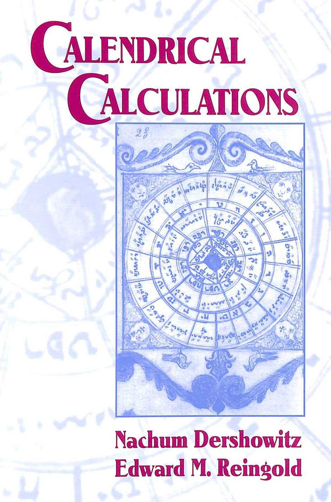{.image-right}


## {}

::: columns
::: {.column width="60%"}

### Encoding time as data

There are three main ways to store time.

* Time sequences (start, length, frequency)
* Time points (time units since an epoch)
* Time components (year, month, day, ...)

::: {.fragment .fade-up}

R uses all three of these representations:

* `ts` objects are time sequences
* `POSIXct`/`Date` objects are time points
* `POSIXlt` objects are time components
:::
:::
:::

{.image-right}


## {.fragment-remove}

::: columns
::: {.column width="60%"}

### Time in R: `ts`

A `ts` object is *very* efficient (but limited).

::: {.fragment .fade-out fragment-index=1}

```{r}
#| echo: true
ts(
  rnorm(12),
  start = c(2020, 1),
  end = c(2022, 4),
  frequency = 4
)
```

Great for regular time series, with integer frequencies (e.g. months over years).

:::

::: {.fragment .fade-up fragment-index=1}

```{r}
#| echo: true
ts(
  rnorm(10),
  start = c(2020, 1),
  frequency = 365.25
)
```

Terrible for irregular time series with non-integer frequencies (i.e. <= weekly in years).

:::

:::
:::

{.image-right}


## {.fragment-remove}

::: columns
::: {.column width="60%"}

### Time in R: `Date` and `POSIXct`

`Date` and `POSIXct` objects are days and seconds since Unix epoch (1970-01-01).

```{r}
#| echo: true
.Date(5777)
.POSIXct(499163700, tz = "America/Los_Angeles")
```

Time stored in this way is space efficient, supports irregular time series, and can handle time zones.

:::
:::

{.image-right}

## {.fragment-remove}

::: columns
::: {.column width="60%"}

### Time in R: `POSIXlt`

`POSIXlt` objects are lists of time components (year, month of year, day of month, ...).

```{r}
#| echo: true
.POSIXlt(list(
  sec = 0, min = 35L, hour = 1L,
  mday = 26L, mon = 9L, year = 85L, 
  wday = 6L, yday = 298L, isdst = 1L,
  zone = "PDT", gmtoff = -25200L),
  tz = "America/Los_Angeles"
)
```

This data structure is very inefficient, but allows easy access to (and manipulation of) time components.

:::
:::

{.image-right}

## {.fragment-remove}

::: columns
::: {.column width="60%"}
### Time types, models, and systems

::: {.fragment .fade-out fragment-index=6}
::: {.callout-note}

## Time types


* [**Linear time** is linear and unbounded (e.g. dates).]{.fragment .fade-up fragment-index=1}
* [**Cyclical time** repeats in cycles (e.g. day of week).]{.fragment .fade-up fragment-index=2}
* [**Time durations** are lengths of time (e.g. 3 months).]{.fragment .fade-up fragment-index=3}
* [... and many more (any ideas?).]{.fragment .fade-up fragment-index=4}

:::
:::

::: {.fragment .fade-up fragment-index=5}
::: {.callout-note}

## Time models

* **Discrete** time models have indivisible chronons.
* **Continuous** time models allow fractional chronons.

[Mapping discrete time to continuous time (or a more precise chronon) introduces *temporal indeterminancy*.]{.fragment .fade-up fragment-index=2}

:::
:::

::: {.fragment .fade-up fragment-index=6}
::: {.callout-note}

## Time systems

* **Civil time** is based on local laws (time zones)
* **Astronomical time** is based on astronomy (sun, moon)

:::
:::

::: {.fragment .fade-up fragment-index=7}
::: {.callout-important}
## Time is NOT simple!

The `mixtime` package simplifies working with time.

:::
:::

:::
:::

{.image-right}

## {.center}

| Aspect              | `ts` | `Date` | `POSIXct` | `POSIXlt` |
|---------------------|------|--------|-----------|-----------|
| Memory efficient    | ✅   | ✅     | ✅       | ❌        |
| Compute cost        | ✅   | ✅     | ✅       | ❌        |
| Irregular times     | ❌   | ✅     | ✅       | ✅        |
| Time zones          | ❌   | ❌     | ✅       | ✅        |
| Time types          | ❌   | ❌     | ❌       | ❌        |
| Time models         | ❌   | ❌     | ❌       | ❌        |
| Calendars           | ❌   | ⚠️     | ⚠️       | ⚠️        |
| Granularity support | ✅   | ❌     | ❌       | ❌        |
| Mixed granularity   | ❌   | ❌     | ❌       | ❌        |

(⚠️ Gregorian calendar only)


## {.center}

| Aspect              | `ts` | `Date` | `POSIXct` | `POSIXlt` | `mixtime` |
|---------------------|------|--------|-----------|-----------|-----------|
| Memory efficient    | ✅   | ✅     | ✅       | ❌        | ✅        |
| Compute cost        | ✅   | ✅     | ✅       | ❌        | ✅        |
| Irregular times     | ❌   | ✅     | ✅       | ✅        | ✅        |
| Time zones          | ❌   | ❌     | ✅       | ✅        | ✅        |
| Time types          | ❌   | ❌     | ❌       | ❌        | ✅        |
| Time models         | ❌   | ❌     | ❌       | ❌        | ✅        |
| Calendars           | ❌   | ⚠️     | ⚠️       | ⚠️        | ✅        |
| Granularity support | ✅   | ❌     | ❌       | ❌        | ✅        |
| Mixed granularity   | ❌   | ❌     | ❌       | ❌        | ✅        |

(⚠️ Gregorian calendar only)

## {.fragment-remove}

::: columns
::: {.column width="40%"}
:::
::: {.column width="60%"}
### Why do we need `mixtime`?

::: {.fragment .fade-up fragment-index=1}
Existing time objects use single granularities.

::: {.fragment .fade-out fragment-index=4}
::: {.callout-question}
## How do you represent monthly data in R?

::: {.fragment fragment-index=2}
It is common practice to use `Date` with the day of month 1.

`"October 1985"` → `"1985-10-01"`

What about quarterly data? What problems might arise?
:::
:::
:::
:::

::: {.fragment .fade-up fragment-index=3}
::: {.callout-note}
## We often need to *mix time* granularities together

* Temporal reconciliation
* Changing observation frequency
* Combining different data sources
:::

:::

::: {.fragment .fade-up fragment-index=4}
::: {.callout-tip}

## While we're here, let's make it good!

::: {.incremental}

* Consistent (including timezones for all!)
* Efficient (fast and small memory footprint)
* Multi-calendar (not just Gregorian)
* Extensible (endless business calendars exist)

:::
:::
:::

:::
:::

{.image-left}


## {.fragment-remove}

::: columns
::: {.column width="60%"}
### Temporal theory and terminology

::: center

{style="width: 100%;"}
:::

::: {.callout-note}

## Terminology

::: incremental

* A **time unit** is a named unit of time (e.g. day, year).
* A **time granule** is a time unit and value (e.g. 2 weeks).
* A **chronon** is the finest granule of discrete time models.
* A **cycle** is a coarser granule that loops time chronons.
* A **granularity** is a partition of time by granules.
* A **calendar** is a system of time units and their relation.

:::

:::

:::
:::

{.image-right}

## {.fragment-remove}

::: columns
::: {.column width="37.5%"}
:::
::: {.column width="60%"}
### Units, granules, & calendars

{.sticker-float-right}

Calendars are sets of time units.

::: {.fragment .fade-out fragment-index=2}
::: columns
::: {.column width="32%"}
```{r}
#| echo: true
cal_gregorian
```
:::
::: {.column width="32%"}
```{r}
#| echo: true
cal_isoweek
```
:::
::: {.column width="32%"}
```{r}
#| echo: true
cal_sym454
```
:::
:::
:::

::: {.fragment .fade-up fragment-index=1}

Time units are functions that make granules.

```{r}
#| echo: true
cal_gregorian$month(1L, tz = "America/Los_Angeles")
```
:::

::: {.fragment .fade-up fragment-index=2}

and granules are ***everything*** in mixtime.

⏱️ Time type granularities  
🗺️ Time zones (and daylight savings time)  
📅 Calendar systems (and time systems)  
✍️ Time formatting (parse and deparse)  

:::

:::
:::


{.image-left}


## {}

::: columns
::: {.column width="37.5%"}
:::
::: {.column width="60%"}

### Chronons and time points

{.sticker-float-right}

`mixtime` stores time as chronons since  
an epoch (like `Date` \& `POSIXct`).

In `mixtime`, the chronon can be any granule.

::: {.callout-tip}

## Granules galore

* `cal_gregorian$second(1L)` for 1 second
* `cal_gregorian$minute(15L)` for 15 minutes
* `cal_isoweek$week(2L,tz="Asia/Tokyo")`  
  for a fortnight in Tokyo
* `cal_time_lunar$month(1L)` for a lunar cycle
* `cal_time_solar$day(1L,lat=-37.81,lon=144.96)` for a solar day (midnight boundary) in Melbourne

:::

:::
:::

{.image-left}

## {.fragment-remove}

::: columns
::: {.column width="37.5%"}
:::
::: {.column width="60%"}

### Time types: `linear_time()`

{.sticker-float-right}


Linear time vectors are created with `linear_time()` in reference to a chronon.

```{r}
#| echo: true
linear_time(
  5777L,
  chronon = day(1L, tz = "America/Los_Angeles")
)
```

::: {.fragment .fade-up fragment-index=1}
::: {.callout-tip}
## Helper functions

::: {.fragment .fade-out fragment-index=2}

Quickly create common time points with:

::: {.columns style="width: 500px; display: inline-block;"}
::: {.column width="50%"}
* `year()`
* `yearquarter()`
* `yearmonth()`
:::
::: {.column width="50%"}
* `yearweek()`
* `date()`
* `datetime()`
:::
:::
:::

::: {.fragment .fade-up fragment-index=2}

For example...

```{r}
#| echo: true
yearmonth("1985-10-26", tz = "America/Los_Angeles")
```

:::
:::

:::

:::
:::

{.image-left}


## {.fragment-remove}

::: columns
::: {.column width="37.5%"}
:::
::: {.column width="60%"}

### Time types: `cyclical_time()`

{.sticker-float-right}

Cyclical time vectors are created with `cyclical_time()` in reference to a chronon.

```{r}
#| echo: true
cyclical_time(
  "1985-10-26",
  chronon = month(1L, tz = "America/Los_Angeles"),
  cycle = year(1L, tz = "America/Los_Angeles")
)
```

::: {.fragment .fade-up fragment-index=1}
::: {.callout-tip}
## Helper functions

::: {.fragment .fade-out fragment-index=2}

Quickly create common cyclical time points with:

::: {.columns style="width: 500px; display: inline-block;"}
::: {.column width="50%"}
* `month_of_year()`
* `week_of_year()`
* `day_of_year()`
:::
::: {.column width="50%"}
* `day_of_month()`
* `day_of_week()`
* `time_of_day()`
:::
:::
:::

::: {.fragment .fade-up fragment-index=2}

For example...

```{r}
#| echo: true
day_of_week("1985-10-26", tz = "America/Los_Angeles")
```

:::
:::

:::

:::
:::

{.image-left}

## {.fragment-remove}

::: columns
::: {.column width="37.5%"}
:::
::: {.column width="60%"}

### Time types: `duration()`

{.sticker-float-right}

Duration vectors are created with `duration()` in reference to a chronon.

```{r}
#| echo: true
duration(
  3L,
  chronon = year(1L, tz = "Australia/Melbourne"),
)
```

::: {.fragment .fade-up fragment-index=1}
::: {.callout-tip}
## Helper functions

::: {.fragment .fade-out fragment-index=2}

Quickly create common time durations with:

::: {.columns style="width: 500px; display: inline-block;"}
::: {.column width="50%"}
* `years()`
* `quarters()`
* `months()`
* `weeks()`
:::
::: {.column width="50%"}
* `days()`
* `hours()`
* `minutes()`
* `seconds()`
:::
:::
:::


::: {.fragment .fade-up fragment-index=2}

For example...

```{r}
#| echo: true
months(3L, tz = "Australia/Melbourne")
```

:::
:::

:::

:::
:::

{.image-left}


## {.fragment-remove}

::: columns
::: {.column width="37.5%"}
:::
::: {.column width="60%"}

### Time types: `ivs::iv()`

{.sticker-float-right}

Time intervals are no different from  
interval vectors - another type of *semantic vector* that is implemented in the `ivs` R package by @vaughanIvsIntervalVectors2022.

```{r}
#| echo: true
library(ivs)
iv(
  start = date("1955-11-12", tz = "America/Los_Angeles"),
  end = date("1985-10-26", tz = "America/Los_Angeles")
)
```

`ivs::iv()` checks thart `start < end`. Cyclical time and durations can also be used.

:::
:::

{.image-left}

## {}

::: columns
::: {.column width="37.5%"}
:::
::: {.column width="60%"}

### Time models

{.sticker-float-right}

Continuous time allows for fractional chronons, discrete time does not.

```{r}
#| echo: true
date(
  "2026-04-17 09:55:00", 
  tz = "Australia/Melbourne", 
  discrete = FALSE
)
```

::: {.fragment .fade-up}

::: {.callout-tip}
## Integers and doubles


All time types suport continuous \& discrete time models.

Internally, 

* discrete time is stored as integers (1 day = `1L`)
* continuous time is stored as doubles (50% of day = `0.5`)

:::
:::
:::
:::

{.image-left}

## {}


::: {.r-stack}
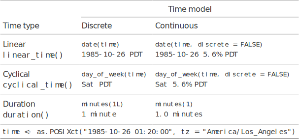{.image-full}
:::

## {}

::: columns
::: {.column width="60%"}

### Manipulating time

{.sticker-float-midright}

Arithmetic can manipulate time.

```{r}
#| echo: true
present <- date("1985-10-26", tz = "America/Los_Angeles")
past <- date("1955-11-05", tz = "America/Los_Angeles")
present - past
```

```{r}
#| echo: true
#| eval: false
past + days(7L)
```

```{r}
date("1955-11-12", tz = "America/Los_Angeles")
```

Summary statistics can also be calculated.

```{r}
#| echo: true
dates <- date(c("1955-11-05", "1985-10-26"), tz = "America/Los_Angeles")
min(dates)
max(dates)
```

:::
:::

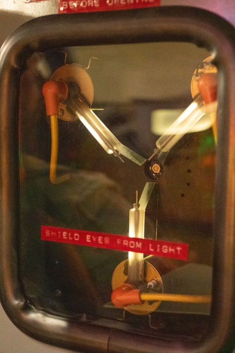{.image-right}


## {}

::: columns
::: {.column width="60%"}

### Rounding time

{.sticker-float-midright}

Time can be rounded to any granularity.

```{r}
#| echo: true
day <- date("1985-10-26", tz = "America/Los_Angeles")
time_round(day, months(1L))
```

::: {.fragment .fade-up}

The floor and ceiling can also be calculated.

```{r}
#| echo: true
time_floor(day, weeks(1L))
time_ceiling(day, years(1L))
```
:::
:::
:::

{.image-right}


## {}

::: columns
::: {.column width="60%"}

### Time sequences

{.sticker-float-midright}

`seq()` makes sequences by durations.

```{r}
#| echo: true
#| warning: true
seq(
  date("2020-01-31"), 
  length.out = 6,
  by = months(1L)
)
```

::: {.fragment .fade-up}

::: {.callout-important}

## Invalid dates

Invalid dates can occur when adding irregular cycles to time points. `mixtime` detects these occurances.

(e.g. `"2020-01-31" + 1 month` → `"2020-02-31"`). 
:::
:::

:::
:::

{.image-right}


## {.fragment-remove}

::: columns
::: {.column width="37.5%"}
:::
::: {.column width="60%"}

### Formatting time

<!-- {.sticker-float-midright} -->

Time is usually formatted with 'strftime'.

::: {.fragment .fade-out fragment-index=3}
::: {.callout-note}
## strftime format codes

* `%Y` for year, `%m` for month, `%d` for day
* `%H` for hour, `%M` for minute, `%S` for second
* `%z` for timezone offset, `%Z` for timezone name

So we write: `"%Y-%m-%d %H:%M:%S %Z"`  
to get: `"1985-10-26 01:35:00 PDT"`.
:::
:::

::: {.fragment .fade-up fragment-index=1}
::: {.callout-question}
## How would I format an ISO-week date?

As in, YYYY-WW-D (e.g. 1985-W43-6).

::: {.fragment .fade-up fragment-index=2}
`%G` for ISO year, `%V` for ISO week, `%u` for day of week (1-7)  
So we write: `"%G-W%V-%u"` to get `"1985-W43-6"`.
:::
:::
:::

::: {.fragment .fade-up fragment-index=3}
::: {.callout-caution}
## strftime issues

* Very cryptic format codes
* Format codes vary by operating system
* Locale-dependent output (e.g. month names)
* Limited to Gregorian and ISOweek calendars
:::
:::

:::
:::

{.image-left}


## {.fragment-remove}

::: columns
::: {.column width="37.5%"}
:::
::: {.column width="60%"}

### Formatting time

{.sticker-float-right}

`mixtime` uses glue-style format strings  
with more descriptive format codes.

::: {.callout-tip}
## mixtime format codes

* Linear granules with `{lin(granule)}`
* Cyclical granules with `{cyc(granule, cycle)}`

::: {.fragment .fade-up}

Where `granule` and `cycle` are:

* time units (e.g. `month`), or
* time granules (e.g. `month(1L)`).

:::

::: {.fragment .fade-up}
The calendar is inherited from the object, but can be explicitly specified with `cal_gregorian$month(1L)`.

This also enables mixed-calendar format strings.
:::
:::

:::
:::

{.image-left}


## {.fragment-remove}

::: columns
::: {.column width="37.5%"}
:::
::: {.column width="60%"}

### Formatting time

{.sticker-float-right}

::: {.fragment .fade-out fragment-index=1}
Each chronon has a default format string.

```{r}
#| echo: true
date(Sys.Date(), calendar = cal_gregorian)
date(Sys.Date(), calendar = cal_isoweek)
date(Sys.Date(), calendar = cal_sym454)
```
:::

::: {.fragment .fade-up fragment-index=1}
::: {.fragment .fade-out fragment-index=2}
Custom format strings can be used, e.g.
:::

```{r}
#| echo: true
# Day of year
format(
  date(Sys.Date()),
  format = "{lin(year)} D{cyc(day, year)}"
)

# Gregorian date (and weekday)
format(
  date(Sys.Date()), 
  format = "{lin(year)}-{cyc(month,year)}-{cyc(day,month)} ({cyc(day, cal_isoweek$week, label = TRUE)})"
)
```
:::

::: {.fragment .fade-up fragment-index=2}
```{r}
#| echo: true
# Gregorian date (and lunar phase emoji)
fmt_gregorian <- "{lin(year)}-{cyc(month,year)}-{cyc(day,month)}"
fmt_lunar <- "{with(cal_time_lunar, cyc(phase, month, emoji = TRUE))}"
format(
  date(Sys.Date()), 
  format = paste(fmt_gregorian, fmt_lunar)
)
```
:::

:::
:::

{.image-left}

## {.center .fragment-remove}

::: {style="font-size: 1.5em;"}
and yes, [`mixtime` *mixes* time systems 🎉]{.fragment fragment-index=1}

::: {.fragment .fade-up fragment-index=2}

📅 Mixed granularities (and calendars)

::: {.fragment .fade-out fragment-index=4}

```{r}
#| echo: true
c(
  date("1985-10-26"), 
  yearweek("1985-10-26"),
  year(1985L)
)
```
:::
:::

::: {.fragment .fade-up fragment-index=4}
🗺️ Mixed time zones (for all granules)
```{r}
#| echo: true
c(
  date("1985-10-26", tz = "America/Los_Angeles"), 
  yearweek("1985-10-26", tz = "Australia/Melbourne"),
  year(1985L, tz = "Asia/Tokyo")
)
```

:::

:::


## {.fragment-remove}

::: columns
::: {.column width="60%"}
### Application - Australian CPI

::: {.fragment .fade-out fragment-index=1}
Last year, the ABS started reporting CPI **monthly** instead of **quarterly**.

Monthly records only go back to **April 2024**, while quarterly records start in **Q3 1948**.
:::

::: {.callout}

## 🦸 Mixed granularity vectors

With `mixtime`, these two data sets can be combined.
:::

::: {.fragment .fade-up fragment-index=1}
::: {.fragment .fade-out fragment-index=2}

::: columns
::: {.column width="50%"}
```{r}
#| cache: true
#| echo: true
readabs::read_abs(series_id="A2325846C") |> 
  dplyr::transmute(
    Time = yearquarter(date), 
    CPI = value
  ) -> cpi_qtr
cpi_qtr
```
:::
::: {.column width="50%"}

```{r}
#| cache: true
#| echo: true
readabs::read_abs(series_id="A130393720C") |> 
  dplyr::transmute(
    Time = yearmonth(date), 
    CPI = value
  ) -> cpi_mth
cpi_mth
```
:::
:::
:::

::: {.fragment .fade-up fragment-index=2}

```{r}
#| echo: true
aus_cpi <- dplyr::bind_rows(
  Quarterly = cpi_qtr,
  Monthly = cpi_mth,
  .id = "Chronon"
)
```


::: columns
::: {.column width="50%"}
```{r}
#| echo: true
head(aus_cpi) 
```
:::
::: {.column width="50%"}

```{r}
#| echo: true
tail(aus_cpi)
```
:::
:::

:::


:::
:::
:::


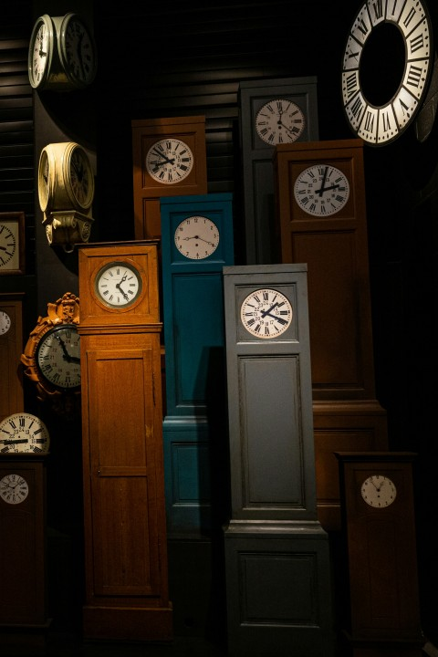{.image-right}


## {.fragment-remove}

::: columns
::: {.column width="60%"}
### Application - Australian CPI

{.sticker-float-midright}

```{r}
#| echo: true
library(ggplot2)
library(ggtime)
library(dplyr)
aus_cpi |> 
  filter(Time >= year(2020)) |> 
  ggplot() +
  aes(x = Time, y = CPI, group = Chronon) +
  geom_line()
```
:::
:::

{.image-right}


## {.fragment-remove}

::: columns
::: {.column width="60%"}
### Application - Aggregation

{.sticker-float-midright}

`tsibble::aggregate_index()`  
aggregates time to coarser granularities.

::: {.fragment .fade-out fragment-index=1}
```{r}
#| echo: true
library(tsibble)
tourism
```
:::

::: {.fragment .fade-up fragment-index=1}
```{r}
#| echo: true
library(tsibble)
tourism |> 
  aggregate_index(
    list(quarter(1L), year(1L)), 
    Trips = sum(Trips)
  )
```
:::


:::
:::

{.image-right}


## {.fragment-remove}

::: columns
::: {.column width="60%"}
### Application - Aggregation

{.sticker-float-midright}

Combined with `aggregate_key()`,  
we can aggregate cross-temporally

```{r}
#| echo: true
library(tsibble)
tourism |> 
  aggregate_key(
    (State / Region) * Purpose,
    Trips = sum(Trips)
  ) |> 
  aggregate_index(
    list(quarter(1L), year(1L)), 
    Trips = sum(Trips)
  )
```


:::
:::

{.image-right}


## {}

::: columns
::: {.column width="37.5%"}
:::
::: {.column width="60%"}
### Timezones and Astronomy

{.sticker-float-right}

Two primitive time units implement timezone and astronomical properties.


::: columns
::: {.column width="48%"}
```{r}
#| echo: true
mt_tz_unit
```
:::
::: {.column width=482%"}
```{r}
#| echo: true
mt_loc_unit
```
:::
:::

:::
:::


{.image-left}

## {.fragment-remove}

::: columns
::: {.column width="37.5%"}
:::
::: {.column width="62%"}
### Timezones and Astronomy

{.sticker-float-right}

Calendars extend primitive time systems.

::: {.fragment .fade-out fragment-index=1}

::: columns
::: {.column width="33%"}
```{r}
#| echo: true
cal_time_civil
```
:::
::: {.column width="33%"}
```{r}
#| echo: true
cal_time_solar
```
:::
::: {.column width="32%"}
```{r}
#| echo: true
cal_time_lunar
```
:::
:::

:::

::: {.fragment .fade-up fragment-index=1}

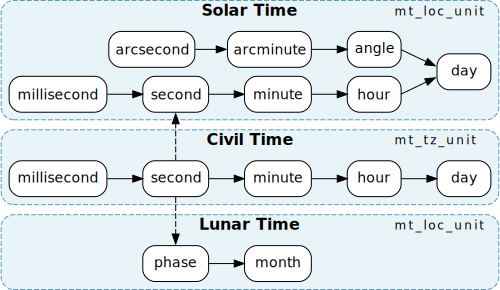

These primitives time units (`mt_tz_unit` and `mt_loc_unit`) provide time zone and location based calculations.

:::

:::
:::


{.image-left}

## {.fragment-remove}

::: columns
::: {.column width="37.5%"}
:::
::: {.column width="62%"}
### Calendrical Calculations

{.sticker-float-right}

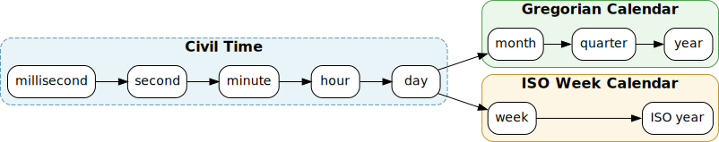

::: {.fragment .fade-out fragment-index=1}
Time units define their cardinality between adjacent granules.

```{r}
#| label: cardinality-hours-in-day
#| echo: true
chronon_cardinality(
  cal_gregorian$hour(1L),
  cal_gregorian$day(1L)
)
```
:::

::: {.fragment .fade-up fragment-index=1}
::: {.fragment .fade-out fragment-index=2}
Cardinality methods are traversed across the graph to compute all cardinality pairs.

```{r}
#| label: cardinality-seconds-in-day
#| echo: true
chronon_cardinality(
  cal_gregorian$second(1L),
  cal_gregorian$day(1L)
)
```
:::
:::

::: {.fragment .fade-up fragment-index=2}
Irregular cardinalities (e.g. days in month) require a time point.

```{r}
yearmonth <- mixtime::yearmonth
yearweek <- mixtime::yearweek
```
```{r}
#| label: cardinality-days-in-month
#| echo: true
chronon_cardinality(
  cal_gregorian$day(1L),
  cal_gregorian$month(1L),
  at = yearmonth("2020-02-01")
)
```
:::

Adjacent units with irregular cardinality also require a divmod function for conversions.

:::
:::

{.image-left}


## {.fragment-remove}

::: columns
::: {.column width="37.5%"}
:::
::: {.column width="62%"}
### Mixed granularity vectors

{.sticker-float-right}

To enable mixed-type vectors in R,  
I've created `vecvec` - vectors of vectors.

```{r}
#| echo: true
library(vecvec)
vecvec(
  month.abb, 
  rnorm(10),
  0i ^ (-3:3)
)
```

[Outside of semantic vectors, `vecvec` is a bad idea for data analysis - it's like Excel but for R.]{.fragment}

:::
:::

{.image-left}


## {.fragment-remove}

::: columns
::: {.column width="37.5%"}
:::
::: {.column width="62%"}
### Mixed granularity vectors

{.sticker-float-right}

A `mixtime` is a mixed-type time vector.

```{r}
#| echo: true
str(
  c(
    yearmonth("1989-10-26", tz = "America/Los_Angeles"),
    yearweek("1989-10-26", tz = "Australia/Melbourne")
  )
)
```

:::
:::

{.image-left}


## {.fragment-remove}

::: columns
::: {.column width="37.5%"}
:::
::: {.column width="62%"}
### Mixed shape distributions

{.sticker-float-right}

This idea also underpins `distributional`

```{r}
#| echo: true
library(distributional)
c(
  dist_normal(0, 1),
  dist_poisson(3)
)
```

::: {.fragment .fade-up}
Distributions are much simpler than time 😅
:::

:::
:::

{.image-left}

## {}

::: columns
::: {.column width="40%"}
:::
::: {.column width="60%"}

### Time for ggplot2

{.sticker-float-right}

Two types of `ggtime` functions:

::: {.callout-note icon=false}
## :framed_picture: Plot helpers

Functions which are used to quickly create a specific plot.

* `autoplot()` / `autolayer()`
* `ggtime::gg_season()`
* `ggtime::gg_subseries()`

:::

::: {.fragment .fade-up}
::: {.callout-tip icon=false}
## :art: Grammar extensions

Functions which add new features to the ggplot2's grammar.

* `ggtime::geom_time_line()`
* `ggtime::scale_x_mixtime()`
* `ggtime::coord_loop()`

:::
:::


:::
:::

{.image-left}

## {.fragment-remove}

::: columns

::: {.column width="60%"}

### Geometries

* `geom_time_line()`

  ::: {.fragment .fade-out fragment-index=2}
  A time-aware version of `geom_line()`. Shows timezone offsets with dashed lines from the `[x/y]_time_offset` **aesthetic**.
  
  ```{r}
  #| code-fold: true
  #| echo: true
  library(dplyr)
  library(ggdist)
  library(ggtime)
  library(lubridate) # TODO - remove
  library(ggplot2)
  tz_shift <- as_tibble(tsibbledata::gafa_stock) |>
    filter(
      (Symbol == "AAPL" & Date <= "2014-01-15") | 
        (Symbol == "GOOG" & Date <= "2014-01-13")
    ) |>
    mutate(Date = Sys.Date() + lubridate::hours(c(1:3, 3:9, 1:2, 4:9)), DST = ifelse(Symbol == "AAPL", "DST Ends", "DST Begins")) |> 
    slice(1:3, 3:12, 12:n()) |> 
    mutate(
      open = duplicated(Open),
      closed = c(open[-1], FALSE),
      Date = Date + open*3600*((DST=="DST Begins")*2-1)
    ) 
  
  tz_shift |> 
    ggplot(aes(x = Date, y = Close)) + 
    geom_path(aes(group = cumsum(open))) + 
    geom_path(linetype = "dashed", data = filter(tz_shift, open | closed)) +
    facet_wrap(vars(DST), ncol = 2, scales = "free_y") + 
    scale_shape_manual(values = c("TRUE" = 16, "FALSE" = 1)) + 
    guides(shape = "none")
  ```
  
  :::


::: {.fragment .fade-up fragment-index=2}
* `geom_time_candle()`

  Shows value changes over time periods (e.g. daily, weekly, ...) which are calculated using the `stat_candle` **statistic**.
  
```{r}
#| code-fold: true
#| echo: true
#| fig-height: 3.5
tsibbledata::gafa_stock |> 
  filter(Symbol == "GOOG") |> 
  filter(tsibble::yearmonth(Date) == tsibble::yearmonth("2014 Jun")) |> 
  ggplot(aes(x = Date)) + 
  tidyquant::geom_candlestick(
    aes(open = Open, high = High, low = Low, close = Close),
    colour_up = "#1FB974", fill_up = "#1FB974", colour_down = "#F4375D", fill_down = "#F4375D"
  ) + 
  scale_x_date(date_labels = "%d %b %Y") +
  labs(y = "GOOG Stock")
```
:::


:::
:::

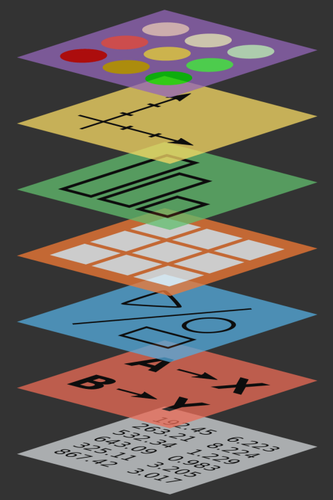{.image-right}

## {.fragment-remove}

::: columns

::: {.column width="60%"}

### Positions [these are now in scale]

The x/y position of time is timezone adjusted:

* `position_time_absolute()` positions time at its exact global location.

  ::: {.fragment .fade-out fragment-index=1}
  ```{r}
  #| code-fold: true
  #| echo: true
  #| fig-height: 3.5
  library(tsibble)
  pedestrian |> 
    filter(Sensor == "Southern Cross Station") |> 
    filter(lubridate::year(Date_Time) == 2015) |> 
    mutate(Date_Time = force_tz(make_datetime(lubridate::year(Date), lubridate::month(Date), lubridate::day(Date), Time), "Australia/Melbourne")) |> 
    ggplot(aes(x = Date_Time - as.POSIXct(Date), y = Count, group = Date)) + 
    geom_line(alpha = 0.2) + 
    theme(axis.text.x = element_blank()) + 
    labs(x = "Time", title = "Hourly pedestrians passing Southern Cross Station")
  ```

  Timezone differences (e.g. daylight savings) misaligns seasonal patterns.
  :::

::: {.fragment .fade-up fragment-index=1}
* `position_time_civil()` positions time as it appears locally in each timezone.


  ```{r}
  #| code-fold: true
  #| echo: true
  #| fig-height: 3.5
  pedestrian |> 
    filter(Sensor == "Southern Cross Station") |> 
    filter(lubridate::year(Date_Time) == 2015) |> 
    ggplot(aes(x = Time, y = Count, group = Date)) + 
    geom_line(alpha = 0.2) + 
    theme(axis.text.x = element_blank()) + 
    labs(x = "Time", title = "Hourly pedestrians passing Southern Cross Station")
  ```

:::
<!-- TODO: Add example from pedestrian counters -->

:::
:::

{.image-right}


## {}

::: columns

::: {.column width="60%"}

### Scales

:::{style="font-size:80%;"}
The scales in `ggplot2` provide:

* `scale_*_date()` for `Date`, 
* `scale_*_datetime()` for `POSIXct`, 
* `scale_*_time()` for `hms`.

Extension packages (e.g. `tsibble`) add:

* `scale_*_yearquarter()` for `yearquarter`,
* `scale_*_yearmonth()` for `yearmonth`, 
* `scale_*_yearweek()` for `yearweek`.
:::

::: {.fragment .fade-up}
::: {.callout-tip style="margin-top: -1em;"}

## Unified scales for time series

`mixtime` has many calendars and granularities.

`ggtime` unifies them all with `scale_*_mixtime()`.

:::
:::

:::
:::

{.image-right}


## {}

::: columns

::: {.column width="60%"}

### Scales

The mixtime scales support temporal labels and breaks, much like ggplot2:

* `time_labels` (mixtime format strings)
* `time_breaks` (duration, e.g. `months(3L)`)

::: {.fragment .fade-up}

These scales also have alignment options:

* `align_discrete` (numeric, 0-1)
* `time_warp` (duration, e.g. `months(1L)`)
  `warp` (times, e.g. `2025-01-28`)

:::

:::
:::

{.image-right}


## {.fragment-remove}

::: columns

::: {.column width="40%"}
:::
::: {.column width="60%"}

### Granularity alignment

::: {.fragment .fade-out fragment-index=1}
`{ggtime}` **aligns mixed granularities**.

Imagine Australian births (annual) compared with total births by state (monthly).
:::

```{r}
recent_births <- fpp3::aus_births |> 
  filter(Month >= tsibble::yearmonth("2016 Jan"))

aus_total_births <- recent_births |> 
  index_by(year = lubridate::year(Month)) |> 
  summarise(Births = sum(Births))

recent_births |>
  summarise(Births = sum(Births)) |> 
  ggplot(aes(x = Month, y = Births)) + 
  geom_line() + 
  geom_line(aes(x = make_date(year = year), y = Births / 12), data = aus_total_births, colour = "steelblue", linewidth = 1.5) +
  geom_point(aes(x = make_date(year = year), y = Births / 12), data = aus_total_births, colour = "darkblue", size = 5)
```

::: {.fragment .fade-up fragment-index=1}
::: {.callout-note icon=false}

## :date: Temporal alignment across granularities

When constrained to Date and POSIXct, left alignment is commonly used for less-frequent granularities.

e.g. `2025-01-01` can be 2025, Jan 2025, or Jan 1 2025.

Consequently, plotting is also often left-aligned.
:::
:::

:::
:::

{.image-left}


## {.fragment-remove}

::: columns

::: {.column width="40%"}
:::
::: {.column width="60%"}

### Granularity alignment

`{ggtime}` center aligns granularities.

```{r}
recent_births <- fpp3::aus_births |> 
  filter(Month >= tsibble::yearmonth("2016 Jan"))

aus_total_births <- recent_births |> 
  index_by(year = lubridate::year(Month)) |> 
  summarise(Births = sum(Births))

recent_births |>
  summarise(Births = sum(Births)) |> 
  ggplot(aes(x = Month, y = Births)) + 
  geom_line() + 
  geom_line(aes(x = make_date(year = year, month = 6), y = Births / 12), data = aus_total_births, colour = "forestgreen", linewidth = 1.5) +
  geom_point(aes(x = make_date(year = year, month = 6), y = Births / 12), data = aus_total_births, colour = "darkgreen", size = 5)
```

::: {.callout-note icon=false}

## :date: Aligning temporal granularities

Specify alignment of different granularities with `scale_x_mixtime(align_discrete = aes_nudge())`.
:::

:::
:::

{.image-left}


## {.fragment-remove}

::: columns

::: {.column width="40%"}
:::
::: {.column width="60%"}

### Time warping

`{ggtime}` defaults to center alignment.

::: {.fragment .fade-out fragment-index=1}

Cycles are repeating patterns with an irregular duration (and shape).

```{r}
#| fig-height: 6.5
month_progress <- unlist(lapply(lubridate:::N_DAYS_IN_MONTHS, \(x) seq(1, x)/x))

time <- make_date(year = 2025) + 0:364
# y <- rnorm(length(month_progress), mean = month_progress^4, sd = month_progress*0.1)
y <- sin(month_progress*2*pi) + rnorm(365, sd = 0.1)


tbl_ragged <- tibble(time, y, month_progress)
tbl_ragged |> 
  ggplot(aes(x = time - floor_date(time, "month"), y = y, group = month(time))) + 
  geom_line() +
  geom_point(
    data = tbl_ragged |> group_by(yearmonth(time)) |> filter(time %in% range(time)),
    size = 3
  ) + 
  facet_grid(rows = vars(month(time, label = TRUE))) + 
  labs(x = "Day of month")

```
:::

::: {.fragment .fade-up fragment-index=1}

Warping cycles to have the same length as "% of cycle" can help **compare cycle shapes**.

::: {.fragment .fade-out fragment-index=2}
```{r}
#| fig-height: 6.5
month_progress <- unlist(lapply(lubridate:::N_DAYS_IN_MONTHS, \(x) seq(1, x)/x))

time <- make_date(year = 2025) + 0:364
# y <- rnorm(length(month_progress), mean = month_progress^4, sd = month_progress*0.1)
y <- sin(month_progress*2*pi) + rnorm(365, sd = 0.1)

tbl_justified <- tibble(time, y, month_progress)
tbl_justified |> 
  ggplot(aes(x = month_progress, y = y, group = month(time))) + 
  scale_x_continuous(labels = scales::percent) +
  geom_line() +
  geom_point(
    data = tbl_justified|> group_by(yearmonth(time)) |> filter(time %in% range(time)), 
    size = 3
  ) +
  facet_grid(rows = vars(month(time, label = TRUE))) + 
  labs(x = "Percentage of month")
```
:::
:::

::: {.fragment .fade-up fragment-index=2}

::: {.callout-note icon=false}

## :date: Temporal alignment across cycles

In `scale_x_mixtime()`, warp time with

* `warp` (stretch time between specific time points)
* `time_warp` (stretch time by duration, e.g. `"1 month"`)

:::
:::

:::
:::

{.image-left}

## {}

::: columns

::: {.column width="60%"}

### Facets & Coordinates

Season plots loop time over seasonalities.

* `coord_loop()`

The time loop points can be specified with:

* `loops` (loop over specific time points)
* `time_loops` (over durations - `weeks(1L)`)

:::
:::

{.image-right}

## Thanks for your time!

::: columns
::: {.column width="60%"}

::: {.callout-tip}
## Final remarks

* Good design makes complicated things accessible.
* Statistical software with semantic vectors is safer.
* Try mixtime (and distributional)!
:::

::: {.callout-link}

## Useful links

{.icon} [social.mitchelloharawild.com](https://social.mitchelloharawild.com/)

{.icon} [slides.mitchelloharawild.com/mixtime-supsi](https://slides.mitchelloharawild.com/mixtime-supsi)

{.icon} [mitchelloharawild/mixtime-supsi](https://github.com/mitchelloharawild/mixtime-supsi)

:::

:::
:::

{.image-right}

## References